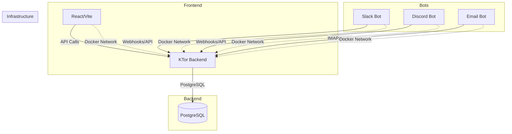

<p align="center">
  
</p>

# Angora

[](https://github.com/LD-C-Software/angora/actions/workflows/ci.yml)

Website: [angora.cloud](https://angora.cloud)

Angora is a self-hosted CRM/support system with a modern full-stack architecture. Every component runs in containers — Docker or Podman, see [Container Runtime](#container-runtime) below.

## Table of Contents

- [Architecture](#architecture)
- [Tech Stack](#tech-stack)
- [Container Runtime](#container-runtime)
- [Modules](#modules)
- [Prerequisites](#prerequisites)
- [Running the App](#running-the-app)
- [Services](#services)
- [Development](#development)
- [Dependency Management](#dependency-management)
- [CI, Git Hooks \& Deployment](#ci-git-hooks--deployment)
- [Docker Compose Commands](#docker-compose-commands)
- [Environment Variables](#environment-variables)
- [Project Structure](#project-structure)
- [Health Checks](#health-checks)
- [Database](#database)
- [Limitations](#limitations)
- [Agent Configuration](#agent-configuration)
- [Troubleshooting](#troubleshooting)
- [Contributing](#contributing)
- [License](#license)

## Architecture



## Tech Stack

| Component         | Technology                                                  |
| -------------------- | ---------------------------------------------------------------- |
| Backend            | KTor 3.5.1, Kotlin 2.4.0, Exposed ORM 1.3.1, Flyway 12.11.0, PostgreSQL 18 |
| Frontend           | React 19, TypeScript 7, Vite 8                                    |
| Bots               | Node.js 24+, TypeScript 7                                          |
| Containerization   | Docker + Docker Compose (or Podman + `podman-compose`, see below)  |

## Container Runtime

Every `docker` / `docker-compose` command in this README and the module docs works the same with **Podman**: swap `docker-compose` for `podman-compose` (or the `podman compose` subcommand on Podman 4+, which delegates to whichever compose provider is installed — `podman-compose` here) and `docker` for `podman`. Both read the same `docker-compose.yml`, so nothing else about the setup changes. Verified against Podman 5.7.0 / `podman-compose` 1.5.0.

```bash
# Docker
docker-compose up --build
docker ps

# Podman equivalent
podman-compose up --build
podman ps
```

If you don't have Docker installed at all, use Podman throughout — none of the instructions below assume one specifically, they just show `docker`/`docker-compose` since that's this repo's primary-documented runtime.

## Modules

Each service has its own README with service-specific setup, commands, and troubleshooting. Kept here at the root: the docker-compose quickstart, environment variables, dependency/CI/hooks conventions, and anything else that spans more than one module.

| Module | Docs |
| -------- | ------ |
| Backend (KTor + Exposed ORM) | [`apps/backend/README.md`](apps/backend/README.md) |
| Frontend (React + Vite) | [`apps/frontend/README.md`](apps/frontend/README.md) |
| Slack bot | [`apps/bots/slack/README.md`](apps/bots/slack/README.md) |
| Discord bot | [`apps/bots/discord/README.md`](apps/bots/discord/README.md) |
| Email bot | [`apps/bots/email/README.md`](apps/bots/email/README.md) |
| Shared TS/ESLint/Prettier/Vite config (`@angora/config`) | [`packages/config/README.md`](packages/config/README.md) |

## Prerequisites

To run the whole stack, you only need a container runtime — either:

- **Docker** and **Docker Compose v2** (`docker compose version` or `docker-compose version`), or
- **Podman** and `podman-compose` (`podman --version` and `podman-compose --version`) — see [Container Runtime](#container-runtime)

To develop a service outside its container (faster feedback loop than rebuilding an image on every change), you'll also need, depending on what you're touching:

| Working on | Install |
| ------------ | --------- |
| Frontend (`apps/frontend`) or bots (`apps/bots/*`) | Node.js 24.x and pnpm — `corepack enable` picks up the version pinned in [package.json](package.json)'s `packageManager` field automatically; otherwise `npm install -g pnpm@11.13.1` |
| Backend (`apps/backend`) | JDK 25 and Maven |

## Running the App

```bash
# Clone the repo, then from its root:
docker-compose up --build
```

This will:

1. Start PostgreSQL on port 5432
2. Start the KTor backend on port 8080
3. Start the React frontend on port 3000
4. Start all bot services (Slack, Discord, Email)

Once it's up:

- Frontend: [http://localhost:3000](http://localhost:3000)
- Backend health check: [http://localhost:8080/api/health](http://localhost:8080/api/health)

Run it in the background with `docker-compose up --build -d`, watch logs with `docker-compose logs -f`, and stop everything with `docker-compose down` (see [Docker Compose Commands](#docker-compose-commands) for more).

## Services

| Service | Port | Description | Container |
| --------- | ------ | -------------- | ----------- |
| postgres | 5432 | PostgreSQL database | angora-postgres |
| backend | 8080 | KTor REST API | angora-backend |
| frontend | 3000 | React web application | angora-frontend |
| slack-bot | 3002 (internal only) | Slack integration bot | angora-slack-bot |
| discord-bot | 3001 (internal only) | Discord integration bot | angora-discord-bot |
| email-bot | 3003 (internal only) | Email processing bot | angora-email-bot |

"Internal only" ports aren't published to the host (no `ports:` mapping in `docker-compose.yml`) — reachable from other containers on `angora-network` only, and used for the bots' healthchecks (see [Health Checks](#health-checks)).

## Development

Running everything through `docker-compose up --build` works, but rebuilding an image for every code change is slow. For active development, run Postgres (and whichever services you're _not_ editing) in Docker, and run the service you're actually working on directly on your machine — see each module's README for the specifics.

Two root-level scripts run the frontend/backend dev servers without `cd`-ing into their directories first:

```bash
docker-compose up -d postgres   # backend needs this running

pnpm run dev:frontend   # vite dev server on :3000
pnpm run dev:backend    # Ktor hot-reload server on :8080 — requires JDK 25 + Maven on PATH
```

Install JS/TS dependencies once from the repo root — this covers the frontend, all three bots, and the shared `packages/config`, and also sets up the git hooks described in [CI, Git Hooks & Deployment](#ci-git-hooks--deployment):

```bash
pnpm install
```

Root-level aggregate scripts run the same check across every JS/TS package at once — useful before pushing, and exactly what CI runs:

```bash
pnpm run lint          # eslint across frontend + all 3 bots
pnpm run typecheck     # tsc --noEmit across frontend + all 3 bots
pnpm run test          # vitest across frontend + all 3 bots
pnpm run format:check  # prettier, repo-wide (pnpm run format to auto-fix)
```

## Dependency Management

### Pinning

Every dependency in this repo is pinned to an exact version — no `^`/`~` ranges in `package.json`, no version ranges or `LATEST`/`RELEASE` in `pom.xml`. Upgrades are explicit, reviewed edits, not something that happens silently on a fresh `install`.

### Sharing versions across packages (pnpm catalog)

The workspace (`apps/frontend` + the three bots + `packages/config`) uses a [pnpm catalog](https://pnpm.io/catalogs) for dependencies used by more than one package, all defined once in `pnpm-workspace.yaml`:

```yaml
catalog:
  typescript: 7.0.2
  eslint: 10.7.0
  typescript-eslint: 8.63.0
  '@eslint/js': 10.0.1
  globals: 17.7.0
  eslint-config-prettier: 10.1.8
  eslint-plugin-react-hooks: 7.1.1
  eslint-plugin-react-refresh: 0.5.3
  prettier: 3.9.5
  vite: 8.1.4
  vitest: 4.1.10
  '@types/node': 24.13.3
```

Each `package.json` references an entry as `"typescript": "catalog:"` instead of repeating the version. To bump one everywhere, edit the single line in `pnpm-workspace.yaml` and run `pnpm install`. The backend is a single Maven module, so there's no equivalent "share across modules" story on that side — its versions already live in one place, `apps/backend/pom.xml`.

### Sharing tool configs

TypeScript, ESLint, Prettier, and Vite configuration for `apps/frontend` and the three bots all come from one shared package, `packages/config` (`@angora/config`) — see its own [README](packages/config/README.md) for what's in it and why the ESLint configs deliberately stay plain `.mjs` instead of `.ts`.

### Guardrail: no package younger than 7 days

Newly-published versions are a common supply-chain attack vector (a maintainer's account gets compromised, a malicious version goes out, and it's often caught and pulled within days). This repo blocks installing anything published in the last week:

- **Frontend + bots (pnpm)**: `pnpm-workspace.yaml` sets `minimumReleaseAge: 10080` (7 days, in minutes) with `minimumReleaseAgeStrict: true`. This is enforced natively by pnpm on every `pnpm install`/`pnpm add` — for direct **and** transitive dependencies — and it re-verifies the committed `pnpm-lock.yaml` on every install, not just when adding something new. A too-new resolution makes the install fail outright rather than silently substituting an older version.
- **Backend (Maven)**: Maven has no built-in equivalent, so `scripts/check-dependency-age.ts` audits `apps/backend/pom.xml` (and, as a second line of defense, the npm side too) against each artifact's actual publish date on Maven Central / the npm registry:

  ```bash
  node scripts/check-dependency-age.ts
  # or
  pnpm run check:dep-age
  ```

  This is a verification gate you run before merging a dependency bump (it also runs in CI) — unlike the pnpm guardrail, it can't stop a `mvn install` from happening automatically, since Maven doesn't expose a hook for that.

## CI, Git Hooks & Deployment

### Git hooks (Husky)

`pnpm install` automatically wires up two hooks via the root `prepare` script:

| Hook | What it does |
| ------ | --------------- |
| `pre-commit` | Runs `pnpm run lint` and `pnpm run format:check`. Check-only — it blocks the commit on a violation rather than auto-fixing; run `pnpm run format` (or fix the lint error) and commit again. |

**`main` is protected server-side by GitHub branch protection**, not just a local hook: pull requests require 1 approval (stale reviews dismissed on new commits), the `backend`, `frontend-bots`, and `guardrails` CI checks must pass, conversations must be resolved, admins are included, and force-pushes/deletion are blocked. There used to be a local `pre-push` hook standing in for this before the repo went public — it's been removed now that the real thing is in place.

### CI (`.github/workflows/ci.yml`)

Runs on every pull request targeting `main` and every push to `main`:

| Job | What it runs |
| ----- | -------------- |
| `backend` | `mvn test` against `apps/backend` |
| `frontend-bots` | `pnpm run lint`, `pnpm run format:check`, `pnpm run typecheck` (+ the frontend's extra `tsconfig.node.json` check), `pnpm run test`, `pnpm -r run build` |
| `guardrails` | `node scripts/check-dependency-age.ts` |

The badge at the top of this README reflects the latest run against `main`. All third-party GitHub Actions are pinned to a commit SHA rather than a floating version tag.

### Deploy (`.github/workflows/deploy.yml`)

A placeholder, currently **manual-trigger only** (`workflow_dispatch` — run it from the Actions tab or `gh workflow run deploy.yml`). It builds nothing real yet; its steps are TODO stubs for pushing images to a registry and deploying to a real target. It will not run automatically until someone fills those in and changes its trigger to `push: branches: [main]`.

## Docker Compose Commands

Using Podman instead? See [Container Runtime](#container-runtime) — every command below works unchanged with `podman-compose`/`podman` in place of `docker-compose`/`docker`.

```bash
# Start all services
docker-compose up --build

# Start specific service
docker-compose up backend
docker-compose up frontend
docker-compose up slack-bot
docker-compose up discord-bot
docker-compose up email-bot

# View logs
docker-compose logs -f
docker-compose logs backend
docker-compose logs frontend

# Stop all services
docker-compose down

# Stop and remove volumes (including database data)
docker-compose down -v

# View running containers
docker ps

# View container logs
docker logs angora-backend

# Build specific service
docker-compose build backend
docker-compose build frontend

# Pull latest images (if not using build)
docker-compose pull

# Run with production values instead of the local .env / built-in defaults
docker-compose --env-file .env.production up -d --build
```

## Environment Variables

### Docker Compose (`.env`, `.env.production`)

`docker-compose.yml` reads its configurable values (database credentials, host ports) from environment variables, each with a default baked in — so `docker-compose up --build` works with zero setup, with or without a `.env` file present:

| Variable | Default | Used by |
| ---------- | --------- | --------- |
| `POSTGRES_DB` | `angora` | `postgres`, and `backend`'s `DB_URL` |
| `POSTGRES_USER` | `angora` | `postgres`, and `backend`'s `DB_USER` |
| `POSTGRES_PASSWORD` | `angora` | `postgres`, and `backend`'s `DB_PASSWORD` |
| `POSTGRES_PORT` | `5432` | Host port `postgres` publishes to |
| `BACKEND_PORT` | `8080` | Host port `backend` publishes to |
| `FRONTEND_PORT` | `3000` | Host port `frontend` publishes to |
| `DISCORD_BOT_TOKEN` | `YOUR_DISCORD_BOT_TOKEN` | `discord-bot` token for connecting to Discord gateway (idles gracefully if unchanged) |
| `DISCORD_CLIENT_ID` | `123456789012345678` | `discord-bot` application/client ID for command registration and OAuth invite URLs |

- **Local development**: copy [`.env.example`](.env.example) to `.env` (`cp .env.example .env`) and edit it — docker-compose loads `.env` from the project root automatically. This step is optional; the defaults above already match `.env.example`.
- **Production-like run**: copy [`.env.production.example`](.env.production.example) to `.env.production`, fill in real secrets (especially `POSTGRES_PASSWORD`, as the placeholder isn't usable as-is, and real `DISCORD_BOT_TOKEN`/`DISCORD_CLIENT_ID` values if enabling live Discord bot functionality), and pass it explicitly — docker-compose only auto-loads a file literally named `.env`, so this one is opt-in on purpose:
  ```bash
  docker-compose --env-file .env.production up -d --build
  ```
- Both `.env` and `.env.production` are gitignored (only the `.example` templates are tracked) — never commit real credentials.

Backend-specific variables (`DB_URL`, `DB_USER`, `DB_PASSWORD`) are documented in [`apps/backend/README.md`](apps/backend/README.md#environment-variables).

## Project Structure

```
angora/
├── .github/
│   ├── workflows/
│   │   ├── ci.yml                  # backend/frontend-bots/guardrails, on PR + push to main
│   │   └── deploy.yml              # Manual-trigger-only placeholder, see Limitations
│   ├── ISSUE_TEMPLATE/
│   └── pull_request_template.md
│
├── .husky/
│   └── pre-commit                  # lint + format:check, check-only
│
├── apps/
│   ├── backend/                    # KTor + Exposed ORM — see apps/backend/README.md, AGENTS.md
│   ├── frontend/                   # React + Vite — see apps/frontend/README.md, AGENTS.md
│   └── bots/
│       ├── slack/                  # see apps/bots/slack/README.md
│       ├── discord/                # see apps/bots/discord/README.md
│       ├── email/                  # see apps/bots/email/README.md
│       └── AGENTS.md               # Shared agent rules for all three bots
│
├── packages/
│   └── config/                     # @angora/config — see packages/config/README.md, AGENTS.md
│
├── scripts/
│   └── check-dependency-age.ts    # Maven + npm supply-chain age guardrail
├── docker-compose.yml              # frontend/bots build with context: . (repo root); backend keeps context: ./apps/backend
├── package.json                    # Root scripts (lint/typecheck/test/format/prepare), pinned packageManager, husky + prettier devDependencies
├── prettier.config.ts              # Re-exports @angora/config/prettier/index.ts
├── .prettierignore
├── .dockerignore                   # Used by the four root-context builds
├── .env.example                    # Copy to `.env` for local overrides (optional — see Environment Variables)
├── .env.production.example         # Copy to `.env.production`, fill in real secrets, use with --env-file
├── pnpm-workspace.yaml             # pnpm workspace config, catalog, age policy
├── pnpm-lock.yaml                  # Locked versions for the whole JS workspace
├── .gitignore
├── AGENTS.md                       # Repo-wide agent rules; see nested AGENTS.md files above for module-specific ones
└── README.md
```

## Health Checks

Every service in `docker-compose.yml` has a healthcheck, so `docker compose ps` reports `healthy`/`unhealthy` for all six, and `depends_on: condition: service_healthy` gates startup order on it (frontend and all three bots wait for `backend` to be healthy before starting).

| Service | Health Check | Endpoint |
| --------- | --------------- | ---------- |
| PostgreSQL | `pg_isready -U $POSTGRES_USER -d $POSTGRES_DB` | N/A |
| Backend | `curl -f http://localhost:8080/api/health` | `/api/health` |
| Frontend | `wget --spider -q http://localhost:3000/` | `/` (nginx-served SPA index) |
| Slack bot | `wget --spider -q http://localhost:3002/health` | `/health` (internal, not published to the host) |
| Discord bot | `wget --spider -q http://localhost:3001/health` | `/health` (internal; same server as `POST /leave/:guildId`, see [`apps/bots/discord/README.md`](apps/bots/discord/README.md)) |
| Email bot | `wget --spider -q http://localhost:3003/health` | `/health` (internal, not published to the host) |

The three bots use `wget` (not `curl`, which isn't present on `node:24-alpine`) against a minimal `node:http` server that starts unconditionally — this is also what keeps their containers running as long-lived processes rather than exiting after their startup log line.

## Database

- **Engine**: PostgreSQL 18 (Alpine)
- **Database / User / Password / Port**: `angora` / `angora` / `angora` / `5432` by default — override via `POSTGRES_DB`/`POSTGRES_USER`/`POSTGRES_PASSWORD`/`POSTGRES_PORT` in `.env` (see [Environment Variables](#environment-variables))
- **Volume**: `angora-postgres-data`, mounted at `/var/lib/postgresql` (PostgreSQL 18+ images lay out data in a version-specific subdirectory there, not at `/var/lib/postgresql/data` as in older images)
- **Network**: `angora-network` (custom Docker network)
- **Schema**: managed by Flyway migrations, applied automatically on every backend startup — `companies`, `roles`, `users`, `accounts`, `contacts`, `discord_servers`. See [`apps/backend/README.md`](apps/backend/README.md#database-schema) for the table-by-table breakdown and how to add a migration.

Connection details from the backend's own code live in [`apps/backend/README.md`](apps/backend/README.md#database-access).

## Limitations

Things that look done but have known gaps worth knowing about before relying on them:

- **Test coverage is a placeholder, not real coverage.** The backend has zero tests (`mvn test` currently passes only because there's nothing to run). The frontend and each bot have exactly one placeholder Vitest smoke test each, added to give CI something meaningful to run — none of them test actual behavior yet. A green CI run currently means "compiles, lints, and formats correctly," not "is correct."
- **Deploy is not wired up.** `.github/workflows/deploy.yml` is a manual-trigger-only stub with TODO steps — merging to `main` does not deploy anything anywhere yet.

## Agent Configuration

For AI agent assistance with this project, see [AGENTS.md](./AGENTS.md) for repo-wide instructions and constraints. Each module also has its own `AGENTS.md` with rules scoped to that directory: [`apps/backend`](apps/backend/AGENTS.md), [`apps/frontend`](apps/frontend/AGENTS.md), [`apps/bots`](apps/bots/AGENTS.md), [`packages/config`](packages/config/AGENTS.md).

## Troubleshooting

### Common Issues

**Docker/Podman Build Fails**:

- Ensure the runtime is working: `docker --version` (or `podman --version`)
- Check disk space: `docker system df` (or `podman system df`)
- Clean build cache: `docker-compose build --no-cache` (or `podman-compose build --no-cache`)

**Port Already in Use**:

- List processes: `lsof -i :3000` or `lsof -i :8080`
- Kill the conflicting process, or set `FRONTEND_PORT`/`BACKEND_PORT`/`POSTGRES_PORT` in `.env` (see [Environment Variables](#environment-variables)) instead of editing docker-compose.yml

Service-specific issues (backend won't start, frontend can't reach the API, etc.) are covered in each module's own README/Troubleshooting section — see [Modules](#modules).

## Contributing

Every change starts from an issue. Issues are auto-prefixed `ANGORA-<number>` on open (see `.github/workflows/issue-title-prefix.yml`), and branch names must follow the same prefix — a repository ruleset rejects any new branch that isn't named `main` or `ANGORA-<number>-...` (there's no way to have GitHub generate this name for you; type it by hand, including when using the "Create a branch" button on an issue).

1. Create a feature branch named `ANGORA-<issue-number>-short-description` (e.g. `git checkout -b ANGORA-42-fix-login-bug`)
2. Make your changes
3. Test with `docker-compose up --build` (and/or the per-service `lint`/`typecheck`/`test` commands — see the relevant module README)
4. Commit your changes (`git commit -m 'Add some feature'`) — the pre-commit hook runs lint + format:check automatically
5. Push the branch (`git push origin feature/your-feature`) — pushing to `main` directly is blocked locally, see [CI, Git Hooks & Deployment](#ci-git-hooks--deployment)
6. Open a Pull Request — CI runs automatically and reports status on the PR (not yet a hard merge gate, see [Limitations](#limitations))

## License

MIT License
