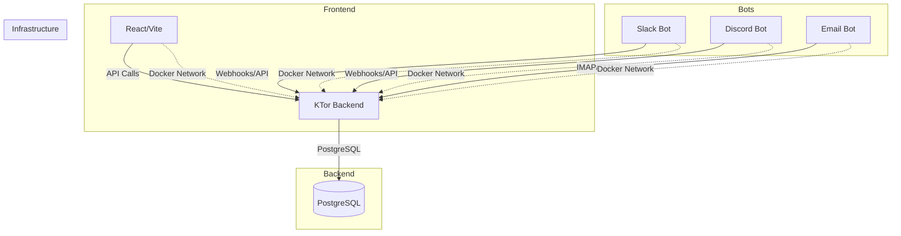

<p align="center">
  
</p>

# Angora

[](https://github.com/LD-C-Software/angora/actions/workflows/ci.yml)

Website: [angora.cloud](https://angora.cloud)

Angora is a self-hosted CRM/support system with a modern full-stack architecture. Every component runs in containers — Docker or Podman, see [Container Runtime](#container-runtime) below.

## Table of Contents

- [Architecture](#architecture)
- [Tech Stack](#tech-stack)
- [Container Runtime](#container-runtime)
- [Modules](#modules)
- [Prerequisites](#prerequisites)
- [Running the App](#running-the-app)
- [Services](#services)
- [Development](#development)
- [Dependency Management](#dependency-management)
- [CI, Git Hooks \& Deployment](#ci-git-hooks--deployment)
- [Docker Compose Commands](#docker-compose-commands)
- [Environment Variables](#environment-variables)
- [Secret Management (Infisical)](#secret-management-infisical)
- [Project Structure](#project-structure)
- [Health Checks](#health-checks)
- [Database](#database)
- [Limitations](#limitations)
- [Agent Configuration](#agent-configuration)
- [Troubleshooting](#troubleshooting)
- [Contributing](#contributing)
- [License](#license)

## Architecture



## Tech Stack

| Component         | Technology                                                  |
| -------------------- | ---------------------------------------------------------------- |
| Backend            | KTor 3.5.1, Kotlin 2.4.0, Exposed ORM 1.3.1, Flyway 12.11.0, PostgreSQL 18 |
| Frontend           | React 19, TypeScript 7, Vite 8                                    |
| Bots               | Node.js 24+, TypeScript 7                                          |
| Containerization   | Docker + Docker Compose (or Podman + `podman-compose`, see below)  |

## Container Runtime

Every `docker` / `docker-compose` command in these docs works with **Podman**: swap in `podman` and `podman-compose`. Both read the same `docker-compose.yml`. Verified against Podman 5.7.0 / `podman-compose` 1.5.0.

```bash
docker-compose up --build     # Docker
podman-compose up --build     # Podman
```

The docs show `docker` throughout only because that's the primary-documented runtime; nothing assumes it.

## Modules

Each module has its own README (setup, commands, troubleshooting) and `AGENTS.md`. The root keeps what spans more than one: the compose quickstart, environment variables, and the dependency/CI/hook conventions.

| Module | Docs |
| -------- | ------ |
| Backend (KTor + Exposed ORM) | [`apps/backend`](apps/backend/README.md) |
| Frontend (React + Vite) | [`apps/frontend`](apps/frontend/README.md) |
| Slack / Discord / Email bots | [`slack`](apps/bots/slack/README.md) · [`discord`](apps/bots/discord/README.md) · [`email`](apps/bots/email/README.md) |
| `@angora/config` — shared TS/ESLint/Prettier/Vite config | [`packages/config`](packages/config/README.md) |
| `@angora/secrets` — runtime secret loading | [`packages/secrets`](packages/secrets/README.md) |

## Prerequisites

A container runtime is all you need to run the stack: Docker + Compose v2, or Podman + `podman-compose` (see [Container Runtime](#container-runtime)).

To develop a service outside its container:

| Working on | Install |
| ------------ | --------- |
| Frontend or bots | Node.js 24.x and pnpm — `corepack enable` picks up the pinned version, or `npm install -g pnpm@11.13.1` |
| Backend | JDK 25 and Maven |

## Running the App

```bash
docker-compose up --build          # add -d to background it
```

- Frontend: [http://localhost:3000](http://localhost:3000)
- Backend health: [http://localhost:8080/api/health](http://localhost:8080/api/health)

Logs with `docker-compose logs -f`, stop with `docker-compose down`. More in [Docker Compose Commands](#docker-compose-commands).

## Services

| Service | Port | Container |
| --------- | ------ | ----------- |
| postgres | 5432 | angora-postgres |
| backend | 8080 | angora-backend |
| frontend | 3000 | angora-frontend |
| discord-bot | 3001 *(internal)* | angora-discord-bot |
| slack-bot | 3002 *(internal)* | angora-slack-bot |
| email-bot | 3003 *(internal)* | angora-email-bot |

Internal ports have no `ports:` mapping — they're reachable only from `angora-network`, and used for the bots' [healthchecks](#health-checks).

## Development

Rebuilding an image per change is slow. Run Postgres (and anything you're not editing) in containers, and the service you're working on directly — see each module's README.

```bash
docker-compose up -d postgres   # backend needs this

pnpm install            # frontend, all 3 bots, packages/*; also installs git hooks
pnpm run dev:frontend   # vite on :3000
pnpm run dev:backend    # Ktor hot-reload on :8080, needs JDK 25 + Maven
```

These run across every JS/TS package at once, and are exactly what CI runs:

```bash
pnpm run lint
pnpm run typecheck
pnpm run test
pnpm run format:check   # pnpm run format to auto-fix
```

## Dependency Management

### Pinning

Every dependency is pinned to an exact version — no `^`/`~` in `package.json`, no ranges or `LATEST`/`RELEASE` in `pom.xml`. Upgrades are explicit, reviewed edits.

### Sharing versions (pnpm catalog)

Dependencies used by more than one JS package are defined once in `pnpm-workspace.yaml` under [`catalog:`](https://pnpm.io/catalogs) — `typescript`, `eslint`, `vite`, `vitest`, `prettier`, `@types/node` and the ESLint plugins. Each `package.json` references them as `"typescript": "catalog:"`, so a bump is one line plus `pnpm install`.

The backend is a single Maven module, so its versions already live in one place: `apps/backend/pom.xml`.

Tool configs (TypeScript, ESLint, Prettier, Vite) come from [`packages/config`](packages/config/README.md).

### Guardrail: nothing younger than 7 days

A compromised maintainer account is usually caught within days, so nothing published in the last week can be installed.

- **pnpm**: `minimumReleaseAge: 10080` with `minimumReleaseAgeStrict: true` in `pnpm-workspace.yaml`. Enforced natively on every install, for direct and transitive dependencies, and re-verified against the committed lockfile. A too-new resolution fails the install.
- **Maven**: no native equivalent, so `scripts/check-dependency-age.ts` audits `pom.xml` (and the npm side too) against real publish dates. Run it before merging a dependency bump; CI runs it as well.

  ```bash
  node scripts/check-dependency-age.ts   # or: pnpm run check:dep-age
  ```

## CI, Git Hooks & Deployment

`pnpm install` wires up one Husky hook via the root `prepare` script: **`pre-commit`**, which runs `pnpm run lint` and `pnpm run format:check`. It's check-only — fix the violation and commit again.

**`main` is protected server-side by GitHub**, not by a local hook: PRs need 1 approval (stale reviews dismissed on new commits), the `backend`, `frontend-bots` and `guardrails` checks must pass, conversations must be resolved, admins are included, and force-push/deletion are blocked. The old local `pre-push` stand-in was removed once this went live.

`.github/workflows/ci.yml` runs on every PR to `main` and every push to `main`:

| Job | What it runs |
| ----- | -------------- |
| `backend` | `mvn test` against `apps/backend` |
| `frontend-bots` | `lint`, `format:check`, `typecheck` (plus the frontend's `tsconfig.node.json` pass), `test`, `pnpm -r run build` |
| `guardrails` | `node scripts/check-dependency-age.ts` |

Third-party Actions are pinned to commit SHAs, not tags.

`.github/workflows/deploy.yml` is a **manual-trigger-only** placeholder with TODO steps. It deploys nothing until someone fills them in.

## Docker Compose Commands

Works unchanged with `podman-compose`/`podman` — see [Container Runtime](#container-runtime).

```bash
docker-compose up --build              # everything
docker-compose up backend              # one service
docker-compose logs -f [service]       # follow logs
docker-compose build backend           # rebuild one service
docker-compose down                    # stop
docker-compose down -v                 # stop and drop the database volume
docker ps                              # running containers

docker-compose --env-file .env.production up -d --build
```

## Environment Variables

### Docker Compose (`.env`, `.env.production`)

`docker-compose.yml` reads its configurable values from environment variables, each with a default, so `docker-compose up --build` works with no `.env` present:

| Variable | Default | Used by |
| ---------- | --------- | --------- |
| `POSTGRES_DB` | `angora` | `postgres`, and `backend`'s `DB_URL` |
| `POSTGRES_USER` | `angora` | `postgres`, and `backend`'s `DB_USER` |
| `POSTGRES_PASSWORD` | `angora` | `postgres`, and `backend`'s `DB_PASSWORD` |
| `POSTGRES_PORT` | `5432` | Host port `postgres` publishes |
| `BACKEND_PORT` | `8080` | Host port `backend` publishes |
| `FRONTEND_PORT` | `3000` | Host port `frontend` publishes |
| `DISCORD_BOT_TOKEN` | `YOUR_DISCORD_BOT_TOKEN` | `discord-bot` gateway token; idles gracefully if unchanged |
| `DISCORD_CLIENT_ID` | `123456789012345678` | `discord-bot` client ID for command registration and invite URLs |
| `SERVICE_TOKEN_DISCORD_BOT` | `dev-discord-bot-token` | Authenticates `discord-bot` → `backend`. Read by **both** and must match |
| `COOKIE_SECURE` | `false` | Marks the session cookie `Secure`. Must be `true` behind TLS; `false` locally |
| `CORS_ALLOWED_ORIGINS` | _(empty)_ | Comma-separated exact origins for credentialed cross-origin requests. Empty is correct here — every setup this repo ships is same-origin. No default is baked in, since a value grants that origin authenticated access |
| `GIT_SHA` | `unknown` | Build arg, not a runtime var. Embedded in the frontend bundle for the sidebar version marker. `.git` isn't in the build context, so set it explicitly: `GIT_SHA=$(git rev-parse --short HEAD) docker-compose up --build frontend` |

- **Local**: `cp .env.example .env` and edit. Optional — the defaults already match.
- **Production**: copy [`.env.production.example`](.env.production.example), fill in real secrets, set `COOKIE_SECURE=true`, and pass it explicitly. Compose only auto-loads `.env`, so this is opt-in on purpose:
  ```bash
  docker-compose --env-file .env.production up -d --build
  ```
- Both are gitignored; only the `.example` templates are tracked.

Authentication behavior, including how to seed the first user, is in [`apps/backend/README.md`](apps/backend/README.md#authentication). Backend-specific variables (`DB_URL`, `DB_USER`, `DB_PASSWORD`) are documented [there too](apps/backend/README.md#environment-variables).

Every value above can instead come from Infisical — see below.

## Secret Management (Infisical)

Secrets in `.env.production` sit in plaintext on whatever host runs the stack. Angora can read them from [Infisical](https://infisical.com) instead, behind one flag.

**Off by default.** With `INFISICAL_ENABLED` unset or `false`, every service reads plain environment variables as documented above and nothing touches the network.

| Variable | Default | Notes |
| ---------- | --------- | ------- |
| `INFISICAL_ENABLED` | `false` | The only off switch. Anything other than `true` means off |
| `INFISICAL_DOMAIN` | `https://eu.infisical.com` | EU Cloud. Use `https://app.infisical.com` for US, or your own origin |
| `INFISICAL_PROJECT_ID` | _(empty)_ | Required when enabled |
| `INFISICAL_ENV` | `dev` | Environment slug, not display name — the UI shows "Development" for `dev` |
| `INFISICAL_SECRET_PATH` | `/` | Folder to read |
| `INFISICAL_CLIENT_ID` / `INFISICAL_CLIENT_SECRET` | _(empty)_ | Machine identity (Universal Auth). The one pair that can't live in Infisical; scope it to this project |
| `INFISICAL_TOKEN` | _(empty)_ | Pre-issued token, used *instead of* the client pair to skip the login call |

Each service fetches once at startup and prefers Infisical over the environment, which stays the fallback. Rotating a secret needs a restart; there is no polling.

If Infisical is enabled but unreachable, services refuse to start. A silent fallback would boot a production deployment on the `angora`/`angora` dev credentials and report healthy.

One stack reads one environment: the same slug goes to every service. Run dev and prod as two stacks, not one straddling both.

`apps/frontend` is excluded on purpose. Vite compiles it to static assets, so anything given at build time ships to every visitor — and it needs no credentials anyway, calling the API same-origin with the session cookie.

### The one exception: Postgres

`postgres` is a third-party image that reads `POSTGRES_PASSWORD` at `initdb` — the first start against an empty volume, before any of our code runs. Covering it means feeding compose's own interpolation, which happens on the host:

```bash
node scripts/infisical-env.ts          # writes .env.infisical (gitignored)
docker-compose --env-file .env.infisical up -d --build
```

**This is a one-time bootstrap, not the normal way to run the stack.** Once the volume exists, `POSTGRES_PASSWORD` is ignored entirely — the container starts fine with it unset — so every later run is a plain `docker-compose up`. Postgres keeps the password it was initialized with, and the backend resolves `DB_PASSWORD` from Infisical in-process.

Two things about that bootstrap run fail quietly:

**`--env-file` replaces `.env` rather than merging with it.** Any variable in `.env` but not in Infisical falls back to the `:-default` in `docker-compose.yml` — `angora` for `POSTGRES_PASSWORD`, `dev-discord-bot-token` for the service token, `false` for `COOKIE_SECURE`. For that one run, the Infisical project must hold **every** variable listed in [Environment Variables](#environment-variables), not just the sensitive ones.

**Changing `POSTGRES_PASSWORD` later doesn't reach the database.** Re-running the script won't help: initdb has already happened. Postgres keeps the old password while the backend picks up the new one, then fails to connect. Rotate with `ALTER USER`, or `docker-compose down -v` to recreate the volume and lose the data.

## Project Structure

```
angora/
├── .agents/skills/pr-review/   # PR review procedure; .claude/skills/pr-review symlinks here
├── .github/workflows/          # ci.yml (PR + push to main), deploy.yml (manual stub)
├── .husky/pre-commit           # lint + format:check, check-only
│
├── apps/
│   ├── backend/                # KTor + Exposed ORM
│   ├── frontend/               # React + Vite
│   └── bots/{slack,discord,email}/
│
├── packages/
│   ├── config/                 # @angora/config — shared TS/ESLint/Prettier/Vite config
│   └── secrets/                # @angora/secrets — runtime secret loading
│
├── scripts/
│   ├── check-dependency-age.ts # Maven + npm supply-chain age guardrail
│   └── infisical-env.ts        # Writes .env.infisical for --env-file (covers postgres)
│
├── docker-compose.yml          # frontend/bots build from repo root; backend from ./apps/backend
├── pnpm-workspace.yaml         # Workspace, catalog, age policy
├── .env.example                # Copy to .env (optional)
├── .env.production.example     # Copy to .env.production, use with --env-file
└── AGENTS.md                   # Repo-wide agent rules; each module has its own
```

Each module directory has its own `README.md` and `AGENTS.md` — see [Modules](#modules).

## Health Checks

All six services have healthchecks, so `docker compose ps` reports `healthy`/`unhealthy`, and `depends_on: condition: service_healthy` gates startup order — the frontend and bots wait for `backend`.

| Service | Health check |
| --------- | -------------- |
| PostgreSQL | `pg_isready -U $POSTGRES_USER -d $POSTGRES_DB` |
| Backend | `curl -f http://localhost:8080/api/health` |
| Frontend | `wget --spider -q http://localhost:3000/` |
| Slack / Discord / Email bots | `wget --spider -q http://localhost:{3002,3001,3003}/health` |

The bots use `wget` because `node:24-alpine` has no `curl`. Their `/health` endpoint is a minimal `node:http` server that starts unconditionally — which is also what keeps the containers alive instead of exiting after the startup log line. The Discord bot's server also handles `POST /leave/:guildId` ([details](apps/bots/discord/README.md)).

## Database

- **Engine**: PostgreSQL 18 (Alpine), on the `angora-network` Docker network
- **Defaults**: `angora` / `angora` / `angora` on `5432` — override via the `POSTGRES_*` variables (see [Environment Variables](#environment-variables))
- **Volume**: `angora-postgres-data` at `/var/lib/postgresql`. PostgreSQL 18 images use a version-specific subdirectory there, *not* `/var/lib/postgresql/data` as older images did
- **Schema**: Flyway migrations, applied on every backend startup — `companies`, `roles`, `users`, `accounts`, `contacts`, `discord_servers`, `sessions`, `user_identities`, `service_tokens`

Table-by-table detail, how to add a migration, and connection handling: [`apps/backend/README.md`](apps/backend/README.md#database-schema).

## Limitations

Known gaps behind things that otherwise look finished:

- **Authentication has no UI.** The backend side is real — login, session cookies, Argon2id, lockout, RBAC principals — but there's no login page, signup, invite, password reset, or email verification. The first user is inserted by hand ([how](apps/backend/README.md#seeding-the-first-user)). Role gating is scaffolded but not applied per route, so any authenticated user reaches every CRM route.
- **Test coverage is uneven.** The backend has Testcontainers integration tests over the Discord repository and the auth layer ([details](apps/backend/README.md#testing)); accounts, contacts and the route layer have none. The frontend and each bot have a single placeholder test. Green CI means "compiles, lints, and the tested slices work" — not "is correct".
- **Deploy is not wired up.** `.github/workflows/deploy.yml` is a manual-only stub with TODO steps.

## Agent Configuration

[AGENTS.md](./AGENTS.md) holds the repo-wide rules; each module directory has its own scoped one. Task procedures live in `.agents/skills/` — outside any vendor directory so every agent can read them. [`pr-review`](.agents/skills/pr-review/SKILL.md) is a read-only review protocol; `.claude/skills/pr-review` symlinks to it.

## Troubleshooting

**Build fails** — check the runtime is up (`docker --version`) and you have disk (`docker system df`); then `docker-compose build --no-cache`.

**Port already in use** — find it with `lsof -i :3000`, then either free it or set `FRONTEND_PORT`/`BACKEND_PORT`/`POSTGRES_PORT` in `.env` rather than editing `docker-compose.yml`.

Service-specific problems are covered in each module's own README — see [Modules](#modules).

## Contributing

Every change starts from an issue. Issues are auto-prefixed `ANGORA-<number>` on open, and a repository ruleset rejects any branch not named `main` or `ANGORA-<number>-...`. GitHub's "Create a branch" button won't generate that name — type it yourself.

1. Branch: `git checkout -b ANGORA-42-fix-login-bug`
2. Make the change, and test it — `docker-compose up --build`, plus the module's own `lint`/`typecheck`/`test`
3. Commit; the pre-commit hook runs lint and format:check
4. Push the branch and open a PR. CI runs automatically, and its three checks are a hard merge gate along with one human approval

Reviewers, human or AI, can follow [`.agents/skills/pr-review/SKILL.md`](.agents/skills/pr-review/SKILL.md) — a read-only procedure covering what CI can't: whether the change matches its linked issue, whether new tests would catch a regression, and whether a new dependency's license is compatible ([AGENTS.md](AGENTS.md#licensing)). It's advisory; approving stays a human action.

## License

MIT License
